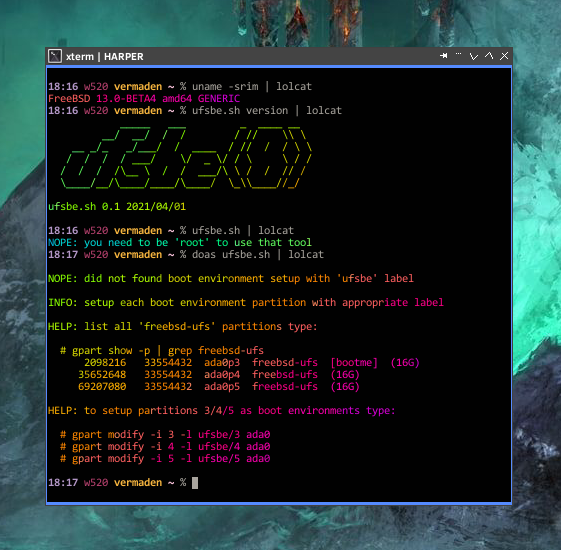

ufsbe
=====

              _____   ___         _  ____ __   
           __/  __/  /  /        / //    \\ \  
      __ _/_   _/___/  /  ____  / //  /  / \ \ 
     /  /  /  / ___/    \/  _ \/ / \     \ / / 
    /  /  /  /\__ \  /  /  ___/\ \ /  /  // /  
    \____/__/\____/____/\____/  \_\\____//_/   

FreeBSD utility to manage Boot Environments on UFS filesystems.

